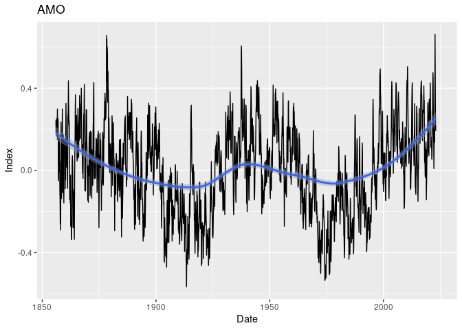
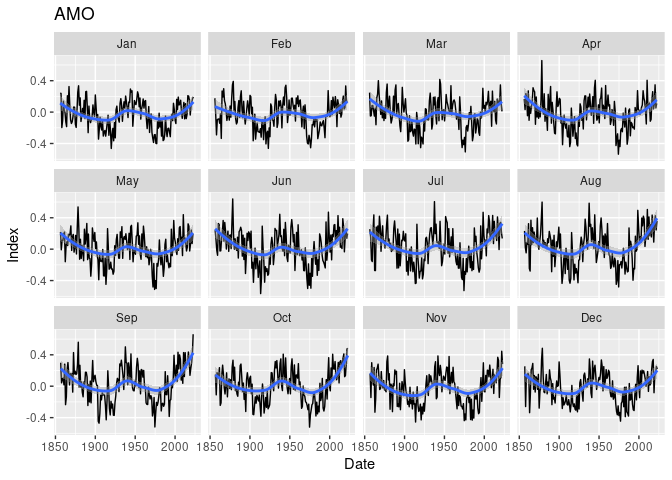
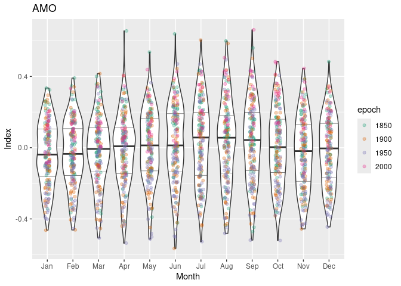
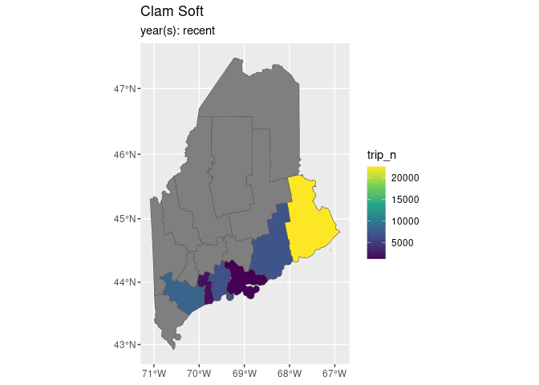
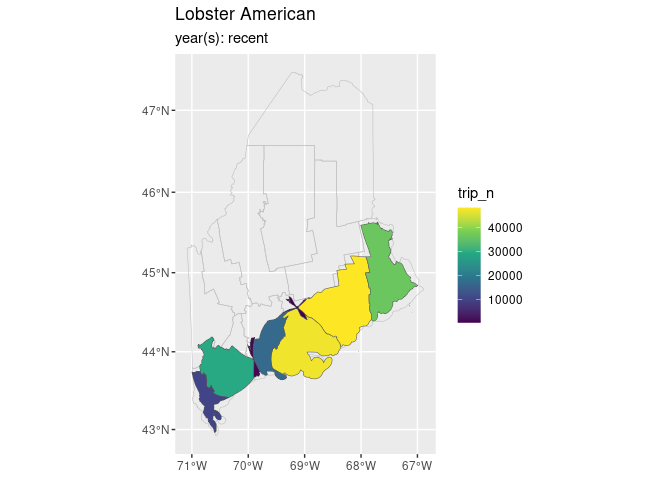

oame
================

# Ocean Account - Maine data

The [oame R package]() serves Maine-centric ocean accounts data.

## Requirements

- [R v4.2+](https://www.r-project.org/)
- [rlang](https://CRAN.R-project.org/package=rlang)
- [ggplot2](https://CRAN.R-project.org/package=ggplot2)
- [dplyr](https://CRAN.R-project.org/package=dplyr)
- [tidyr](https://CRAN.R-project.org/package=tidyr)
- [readr](https://CRAN.R-project.org/package=readr)
- [yaml](https://CRAN.R-project.org/package=yaml)

## Installation

    remotes::install_github("BigelowLab/ocean-accounts-maine/package")

## Reading data

``` r
library(oame)
library(dplyr)
```

    ## 
    ## Attaching package: 'dplyr'

    ## The following objects are masked from 'package:stats':
    ## 
    ##     filter, lag

    ## The following objects are masked from 'package:base':
    ## 
    ##     intersect, setdiff, setequal, union

``` r
nao = read_nao() |> glimpse()
```

    ## Rows: 1,932
    ## Columns: 4
    ## $ date  <date> 1851-01-01, 1851-02-01, 1851-03-01, 1851-04-01, 1851-05-01, 185…
    ## $ year  <dbl> 1851, 1851, 1851, 1851, 1851, 1851, 1851, 1851, 1851, 1851, 1851…
    ## $ month <chr> "Jan", "Feb", "Mar", "Apr", "May", "Jun", "Jul", "Aug", "Sep", "…
    ## $ value <dbl> 2.069, 0.381, 1.741, -3.190, -3.005, -3.630, -5.371, -4.089, -4.…

``` r
amo = read_amo() |> glimpse()
```

    ## Rows: 2,016
    ## Columns: 4
    ## $ date  <date> 1856-01-01, 1856-02-01, 1856-03-01, 1856-04-01, 1856-05-01, 185…
    ## $ year  <dbl> 1856, 1856, 1856, 1856, 1856, 1856, 1856, 1856, 1856, 1856, 1856…
    ## $ month <chr> "Jan", "Feb", "Mar", "Apr", "May", "Jun", "Jul", "Aug", "Sep", "…
    ## $ value <dbl> 0.243, 0.176, 0.248, 0.167, 0.219, 0.241, 0.255, 0.232, 0.299, 0…

``` r
landings = read_dmr_landings("merged") |> glimpse()
```

    ## Rows: 7,710
    ## Columns: 10
    ## $ year        <dbl> 2008, 2008, 2008, 2008, 2008, 2008, 2008, 2008, 2008, 2008…
    ## $ species     <chr> "Bloodworms", "Bloodworms", "Bloodworms", "Bloodworms", "B…
    ## $ port        <chr> "Addison", "Bar Harbor", "Bass Harbor", "Bath", "Beals", "…
    ## $ county      <chr> "Washington", "Hancock", "Hancock", "Sagadahoc", "Washingt…
    ## $ lob_zone    <chr> "UK", "UK", "UK", "UK", "UK", "UK", "UK", "UK", "UK", "UK"…
    ## $ weight_type <chr> "Live Pounds", "Live Pounds", "Live Pounds", "Live Pounds"…
    ## $ weight      <dbl> 18934, 1397, 42, 9408, 1760, 4920, 1206, 233, 11307, 8248,…
    ## $ value       <dbl> 208982, 15277, 449, 101805, 18990, 52021, 13215, 2501, 121…
    ## $ trip_n      <dbl> 2393, 110, 4, 470, 1166, 202, 111, 20, 574, 413, 242, 12, …
    ## $ harv_n      <dbl> 145, 31, 3, 60, 75, 49, 26, 13, 61, 51, 39, 8, 51, 33, 25,…

## Plotting

The NAO and AMO data are identical in structure, so they share three
plotting schemes… but each has a wrapper of it’s own: `plot_nao()` and
`plot_amo()`

``` r
plot_amo(amo, type = "timeseries")
```

    ## Warning: Removed 11 rows containing non-finite outside the scale range
    ## (`stat_smooth()`).

    ## Warning: Removed 11 rows containing missing values or values outside the scale range
    ## (`geom_line()`).

<!-- -->

``` r
plot_amo(amo, type = "monthly")
```

    ## Warning: Removed 11 rows containing non-finite outside the scale range
    ## (`stat_smooth()`).

    ## Warning: Removed 11 rows containing missing values or values outside the scale range
    ## (`geom_line()`).

<!-- -->

``` r
plot_amo(amo, type = "climatology")
```

<!-- -->

``` r
map_species_by_county()
```

<!-- -->

``` r
map_species_by_county(spp = "Lobster American", style = "cartogram")
```

<!-- -->
